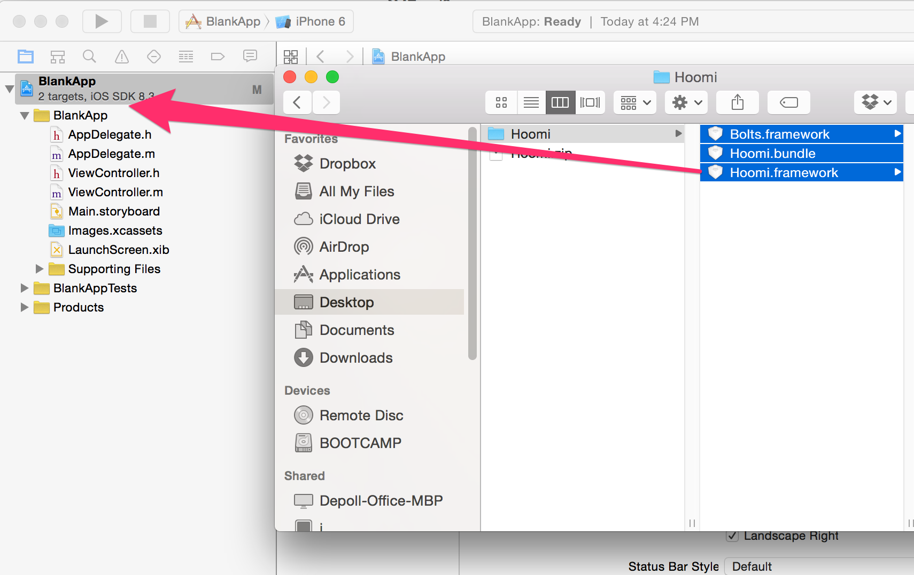
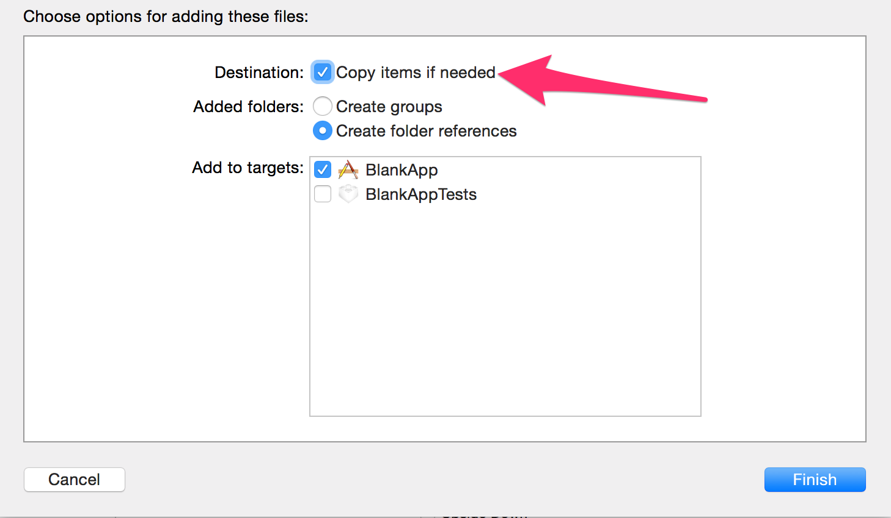
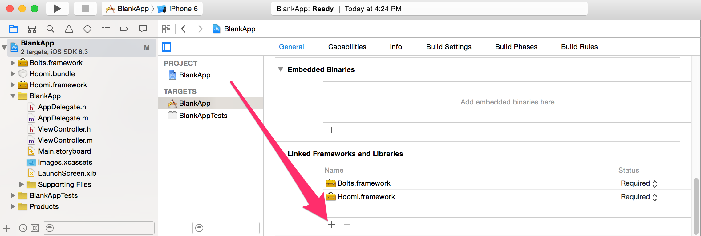

# Hoomi iOS SDK

## Table of Contents

* [API Documentation](https://gethoomi.github.io/hoomi-sdk-ios/docs/html/)
* [Getting Started](#getting-started)
* [Configuring your Application](#configure)
* ["Continue with Hoomi" button](#button-login)
* [Using the API to log in](#api-login)
* [Client Authentication](#client-authentication)
* [Using an Access Token](#using-token)
* [Personalization using App Data](#app-data)

***

## API Documentation

API documentation for the Hoomi iOS SDK can be found [here](https://gethoomi.github.io/hoomi-sdk-ios/docs/html).

<a name="getting-started">
## Getting Started
</a>

Download and extract the Hoomi SDK and its dependencies from our
[GitHub releases page](https://github.com/GetHoomi/hoomi-sdk-ios/releases).

To add the Hoomi iOS SDK to your iOS application, drag and drop all of the files you
extracted into your Xcode project:



You should copy the files into your project:



Next, you must link the frameworks that the Hoomi SDK depends upon by hitting the `+` button in the general
tab of your project's target:



You'll need to add the following dependencies:

* `StoreKit.framework` (used for client authentication)

Once you have added the Hoomi SDK to your project, you should initialize the Hoomi client in your
`AppDelegate`'s `application:didFinishLaunchingWithOptions:`
selector, replacing `HOOMI_APPLICATION_ID` with the application ID for your app from the
[developer portal](https://www.hoomi.co/developer/apps).  You'll need to `#import <Hoomi/Hoomi.h>`
and then call
[`HFClient clientWithApplicationId:`](https://gethoomi.github.io/hoomi-sdk-ios/docs/html/Classes/HFClient.html#//api/name/clientWithApplicationId:):

```objectivec
#import "AppDelegate.h"
#import <Hoomi/Hoomi.h>

@interface AppDelegate ()

// ...

@end

@implementation AppDelegate

// ...

- (BOOL)application:(UIApplication *)application didFinishLaunchingWithOptions:(NSDictionary *)launchOptions {
  HFClient.currentClient = [HFClient clientWithApplicationId:HOOMI_APPLICATION_ID];
  return YES;
}

// ...

@end
```

<a name="configure">
## Configuring your Application
</a>

In order to use Hoomi login, you must allow Hoomi to pass data to your app.  Your app can accomplish this by
handling a specially-crafted URL, which allows the browser or Hoomi app to redirect back to your application
after a user authorizes your app.  The Hoomi SDK provides a
[built-in handler](https://gethoomi.github.io/hoomi-sdk-ios/docs/html/Classes/HFClient.html#//api/name/application:openURL:sourceApplication:annotation:)
that you can call from your `AppDelegate`'s `application:openURL:sourceApplication:annotation:` selector.

To define a redirect handler for your application, you should choose a custom URL scheme.  We
recommend using your application's bundle identifier as the URL scheme.  You must register to handle
that URL scheme by adding a URL Type in your application's "Info" tab:


Finally, you must handle the redirect by adding a call to `HFClient`'s
[`application:openURL:sourceApplication:annotation:`](https://gethoomi.github.io/hoomi-sdk-ios/docs/html/Classes/HFClient.html#//api/name/application:openURL:sourceApplication:annotation:)
selector in your `AppDelegate`:

```objectivec
- (BOOL)application:(UIApplication *)application
            openURL:(NSURL *)url
  sourceApplication:(NSString *)sourceApplication
         annotation:(id)annotation {
  return [self.client application:application
                          openURL:url
                sourceApplication:sourceApplication
                       annotation:annotation];
}
```

This selector returns `YES` if Hoomi has handled the incoming URL.  If you need fallback URL-handling
behavior, you should check its return value before continuing with your own logic.

You must also tell Hoomi that this is a valid redirect for your application.  To do this, open the
[developer portal](https://www.hoomi.co/developer/apps), select your app, and open the "Redirects" tab.
You can add an iOS redirect by clicking the Apple icon at the bottom of the page and giving the redirect
a name.

You should complete the form by providing the URL scheme specified above (e.g. `com.example.myApp`).
Click "Save" and your application will be fully configured to support an iOS redirect target.

<a name="button-login">
## "Continue with Hoomi" button
</a>

You can now easily add Hoomi login to your app using the "Continue with Hoomi" login button, defined by the
[`HFLoginButton`](https://gethoomi.github.io/hoomi-sdk-ios/docs/html/Classes/HFLoginButton.html) class.

`HFLoginButton` can be used much like a built-in `UIButton`, but with just a little configuration will
automatically trigger a Hoomi login for your application.  You can add a view to your layout using
Interface Builder by adding a View (`UIView`) to your layout and then setting its "Custom Class" to
`HFLoginButton`:


You will want to create an `IBOutlet` (and connect it using Interface Builder) for the button so
that you can access it from code:

```objectivec
@property (strong, nonatomic) IBOutlet HFLoginButton *loginButton;
```

After the view containing the button is loaded, you should configure the button, telling it the
redirect URL for your application, which scopes (if any) you would like to request from the user, the
button color scheme to use, and specify a delegate that defines what to do after login completes.
For example, in your ViewController's `viewDidLoad` selector, you might write:

```objectivec
- (void)viewDidLoad {
  [super viewDidLoad];

  self.loginButton.redirectUri = [NSURL URLWithString:@"co.example.myApp://login/"];
  self.loginButton.scopes = @[@"user:app:data:read", @"user:app:data:write"];
  self.loginButton.buttonStyle = HFLoginButtonStyleWhiteOnGreen;
  self.loginButton.delegate = self;
}
```

You can handle login completion with the button by implementing the
[`HFLoginButtonDelegate` protocol](https://gethoomi.github.io/hoomi-sdk-ios/docs/html/Protocols/HFLoginButtonDelegate.html):

```objectivec
- (void)button:(HFLoginButton *)button didPerformHoomiAuthorizationWithResult:(HFAccessToken *)token error:(NSError *)error {
  if (!token) {
    NSLog(@"Login failed!");
    return;
  } else {
    NSLog(@"Login succeeded!");
  }
}
```

After logging in,
[`HFClient.currentClient.currentToken`](https://gethoomi.github.io/hoomi-sdk-ios/docs/html/Classes/HFClient.html#//api/name/currentToken)
will return the token issued for the user, and this value will be cached between runs of your application.

<a name="api-login">
## Using the API to log in
</a>

If you would prefer to use your own button (or some other mechanism) to initiate login with Hoomi,
you can directly call the methods on `HFClient`.  These methods are asynchronous, and return
[Bolts Tasks](https://github.com/BoltsFramework/Bolts-iOS).

When you create your first `HFClient` instance, that client automatically becomes the "current
client", so all you need to do initiate Hoomi authorization is to call
[`authorizeAsyncWithRedirectUrl:scopes:`](https://gethoomi.github.io/hoomi-sdk-ios/docs/html/Classes/HFClient.html#//api/name/authorizeAsyncWithRedirectUrl:scopes:)
with the redirect URL for your application and the scopes you would like to request:

```objectivec
NSURL *url = [NSURL URLWithString:@"com.example.myApp://login"];
NSArray *scopes = @[@"user:app:data:read", @"user:app:data:write"];
BFTask * authorizeTask = [HFClient.currentClient authorizeAsyncWithRedirectUrl:url
                                                                        scopes:scopes];
[authorizeTask continueWithSuccessBlock:^id(BFTask *task) {
  HFAccessToken *token = task.result;
  NSLog(@"Logged in successfully!");
}];
```

After logging in,
[`HFClient.currentClient.currentToken`](https://gethoomi.github.io/hoomi-sdk-ios/docs/html/Classes/HFClient.html#//api/name/currentToken)
will return the token issued for the user, and this value will be cached between runs of your application.

<a name="client-authentication">
## Client Authentication
</a>

iOS apps installed by the app store can use an
[app receipt](https://developer.apple.com/library/ios/releasenotes/General/ValidateAppStoreReceipt/Introduction.html)
to perform client authentication with Hoomi. When your clients are authenticated, Hoomi will issue longer-lived tokens
to your application, and this process can be used to ensure that no malicious apps can masquerade as your
application to get a token for a user that would log them into your apps.

To add client authentication to your application, you will first need to ensure that your app exists in
[iTunes Connect](https://itunesconnect.apple.com).  If your app is already in the app store, you don't need
to do anything special here.  If the app is still in development, create the app by going to "My Apps" and
clicking the "+" button at the top-left corner of the screen and selecting "New iOS App".

Make note of your bundle ID provided in this dialog (which must match the bundle ID of your Xcode project).  You will need this value later.  You *do not* need to actually publish your app to complete client authentication setup.

Now that your app is registered in iTunes Connect, you should add your bundle identifier to the iOS
redirect you defined in the [developer portal](https://www.hoomi.co/developer/apps). You can add multiple bundle IDs
by separating them with commas.

Finally, to enable client authentication in your app, add the following call to
[`enableClientAuthentication`](https://gethoomi.github.io/hoomi-sdk-ios/docs/html/Classes/HFClient.html#//api/name/enableClientAuthentication)
to your `AppDelegate`'s `application:didFinishLaunchingWithOptions:` selector after you initialize
your `HFClient`:

```java
- (BOOL)application:(UIApplication *)application didFinishLaunchingWithOptions:(NSDictionary *)launchOptions {
  HFClient.currentClient = [HFClient clientWithApplicationId:HOOMI_APPLICATION_ID];
  [HFClient.currentClient enableClientAuthentication];
  return YES;
}
```

Client authentication requires the app to have been installed by the app store, and does not work in
the simulator. The SDK will automatically skip client authentication if either
of these conditions are not met.  You can check whether a token was issued to an authenticated client by
[fetching the token information](#using-token) from Hoomi.

You can test client authentication before submitting your app to the app store by creating a
[sandbox user](https://itunesconnect.apple.com/WebObjects/iTunesConnect.woa/ra/ng/users_roles/sandbox_users)
in iTunes Connect and replacing the call to `enableClientAuthentication` with
[`requireClientAuthentication`](https://gethoomi.github.io/hoomi-sdk-ios/docs/html/Classes/HFClient.html#//api/name/requireClientAuthentication).  When you run your app on a device (not in the simulator), you will be prompted
to log into iTunes (you may need to manually log out using the Settings menu in iOS first).
Enter your sandbox user credentials and client authentication will take place.

<a name="using-token">
## Using an Access Token
</a>

After Hoomi has redirected back to your app, authorization completes and your code receives an access token.  You can use
this token to do a number of things on behalf of the user, depending upon the scopes you requested.  The Hoomi SDK will
automatically cache the access token it has received in local storage on the device so that it can be accessed across
runs of the application.

You can retrieve the stored access token at any time by calling
[`HFClient.currentClient.currentToken`](https://gethoomi.github.io/hoomi-sdk-ios/docs/html/Classes/HFClient.html#//api/name/currentToken).

To get information about the access token you have (e.g. the user ID for the user that authorized your application or the
token's expiration time), you can call
[`HFClient.currentClient.tokenInformationAsync`](https://gethoomi.github.io/hoomi-sdk-ios/docs/html/Classes/HFClient.html#//api/name/tokenInformationAsync:).
If the `BFTask` returns successfully, the token is valid, and an
[`HFTokenInformation`](https://gethoomi.github.io/hoomi-sdk-ios/docs/html/Classes/HFTokenInformation.html) provides
information about the token itself.

<a name="app-data">
## Personalization using App Data
</a>

Hoomi makes it easy to store personalization data for your users without having to resort to a dedicated backend.  When you use Hoomi
for login, you can save and retrieve "App Data" for your users, which lets you keep an arbitrary JSON object for each user.  For example,
you might store bookmarks, favorites, preferences, saved games, or high scores for each user, and Hoomi will ensure that access
to that data is restricted to those who have a valid token for the user.

Taking advantage of this feature requires that you request the `user:app:data:read` and `user:app:data:write` scopes during login.
Once you've done this, you can retrieve the App Data for a user by calling
[`appDataAsync`](https://gethoomi.github.io/hoomi-sdk-ios/docs/html/Classes/HFClient.html#//api/name/appDataAsync) like this:

```objectivec
[[HFClient.currentClient appDataAsync] continueWithSuccessBlock:^id(BFTask *task) {
  HFAppData *appData = task.result;
  NSMutableDictionary *data = appData.data;
  return nil;
}];
```

Similarly, you can save App Data using the
[`setAppDataAsync`](https://gethoomi.github.io/hoomi-sdk-ios/docs/html/Classes/HFClient.html#//api/name/setAppDataAsync:)
method:

```objectivec
[HFClient.currentClient setAppDataAsync:@{@"highScore": @9001,
                                          @"favorites": @[favorite1, favorite2],
                                          @"theme": "dark",
                                          @"lastLogin": [[NSDate date] description]}];
```

The [`HFAppData`](https://gethoomi.github.io/hoomi-sdk-ios/docs/html/Classes/HFAppData.html)
object also includes an
[`ETag`](https://gethoomi.github.io/hoomi-sdk-ios/docs/html/Classes/HFAppData.html#//api/name/ETag),
which allows optimistic concurrency control when saving data. Every time your `HFAppData` for
a user changes, the `ETag` gets a new value.  If you pass that `ETag` back to Hoomi while saving a new value, the save will only succeed
if the provided `ETag` matches the current `ETag` in our database. Usually, when this occurs, you'll want to re-fetch the App Data,
reapply your changes, and then attempt to save again.

Unless an access token is explicitly provided, the App Data APIs will use the current token stored for your app.